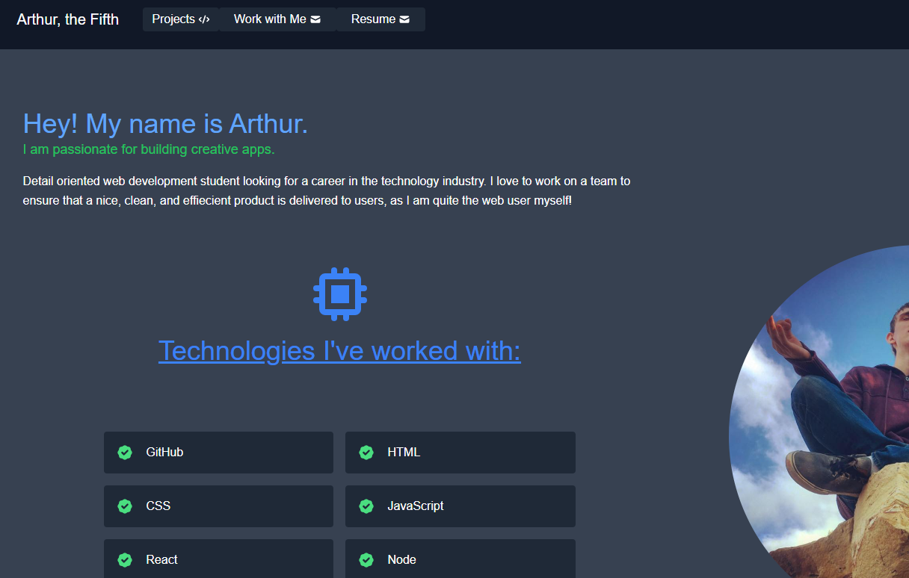

# React Portfolio

## Description

Utilizing the new skills I have been building on within the past 24 weeks, I have refactored the Portfolio I made during the second week of the bootcamp. I have learned a ton throughout the course, especially when my two portfolios are compared. This application includes a blurb about me, a contact form, my portfolio of projects, and my resume.

<a href="https://arthur-cann-5-portfolio.netlify.app/">Deployed Link</a>

## Installation

<ul>
    <li>Clone the GitHub Repository to your local machine</li>
    <li>Open a terminal window</li>
    <li>To Install Packages: Run $ npm i</li>
    <li>Starting Application: Run $ npm start</li>
</ul>       
        
## Usage
 

        
 
## Questions?

Feel free to reach out at any of the links in my portfolio, or my GitHub is here:

https://github.com/artiecannv

## Repository

https://github.com/artiecannv/react-portfolio

## Future Developments

<ul>
    <li>Make contact form more functional</li>
    <li>Make 'Skills' component a little more size friendly</li>
    <li>Apply a motion background to the entire application</li>
    <li>Design favicon and logo for navbar</li>
    <li>Add button either on hover or just underneath each project that is a path that goes to the GitHub Repository</li>
    <li>Continue to update with new projects!</li>
</ul>
